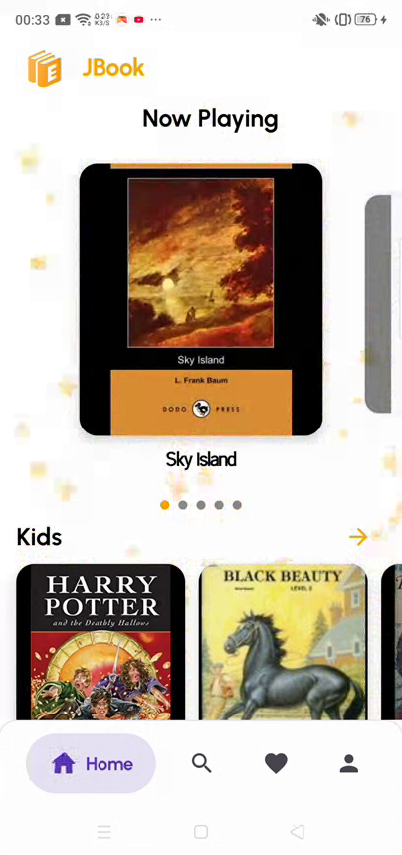

# 📚 JBook - Ứng dụng đọc sách thông minh

JBook là một ứng dụng đọc sách hiện đại, hỗ trợ người dùng đọc sách mọi lúc, mọi nơi với giao diện thân thiện
---

## 🚀 Tính năng nổi bật

- 📖 **Đọc sách đa dạng thể loại**:
- 📑 **Đánh dấu yêu thích**
- 🌙 **Chế độ đọc ban đêm** 
- 🔍 **Tìm kiếm sách thông minh**: Theo tên, tác giả, hoặc thể loại
---

## 🧑‍💻 Công nghệ sử dụng

- **Ngôn ngữ**: Kotlin
- **UI**: Jetpack Compose
- **Kiến trúc**: MVVM + Clean Architecture
- **Navigation**: Jetpack Navigation Compose
- **API**: Kết nối API để lấy dữ liệu sách
- **Firebase**: Lưu thông tin 
- **Coroutine + Flow**: Xử lý bất đồng bộ hiệu quả

---

## 📱 Ảnh minh họa (Screenshots)

| Màn hình chính | Giao diện đọc sách | TTS & Đánh dấu |
|----------------|---------------------|----------------|
|  |  |  |

> *Thêm hình ảnh vào thư mục `assets/` để hiển thị tại đây.*

---

## ⚙️ Cài đặt và chạy app

```bash
git clone https://github.com/your-username/JBook.git
cd JBook
